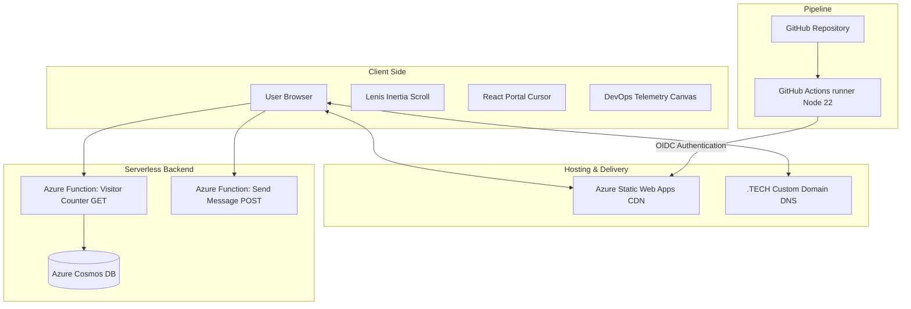

# Sadev Sabuddhika — Cloud & DevOps Portfolio

A lightweight, serverless-first portfolio website designed and optimized for speed, scalability, and modern DevOps aesthetics. 

Live URL: [sadevsabuddhika.tech](https://sadevsabuddhika.tech)

---

## 🏗️ System Architecture

The project is structured with a serverless, decoupled architecture utilizing Microsoft Azure and GitHub Actions.



### 1. Frontend (Static Site Generation / SSG)
*   **Core Stack**: Built with [React](https://react.dev/), [TypeScript](https://www.typescriptlang.org/), and [Tailwind CSS](https://tailwindcss.com/) inside the [TanStack Start](https://tanstack.com/router) framework.
*   **Prerendering**: Native static page generation (SSG) compiles the routes to flat `index.html` markup, serving instantly from the edge and scaling to zero when idle.
*   **Performance Optimizations**:
    *   **Pruned Node Modules**: Removed 141 unused dependencies, reducing the final compiled CSS footprint by **59%** (to 35.70 kB).
    *   **Static Assets**: Localized profile assets and CV downloads inside the pre-rendered structure to prevent network fetch overhead.
*   **UX Adjustments**:
    *   **Lenis Inertia Scrolling**: Implemented smooth momentum-based virtualized scroll wrapper.
    *   **React Portal Blinking Cursor**: Mounted a Unix-style blinking command-line block cursor (`█`) inside a React Portal targeting `document.body` directly, preventing coordinate drifting during active scrolls.
    *   **Scroll-Friendly Highlights**: Bound project layout border/text color shifts directly to a state-driven scroll collision detector using `document.elementFromPoint()`.

### 2. Serverless Backend APIs (Microsoft Azure Functions)
*   **Visitor Counter (GET)**: Fetches and displays real-time visitor counts inside the navigation bar via a secure serverless Azure Function endpoint connected to **Azure Cosmos DB** for data storage.
*   **Email Dispatcher (POST)**: Form submissions on the contact form (`set_name`, `set_email`, `cat << 'EOF' > message.txt`) are processed via a serverless Azure Function forwarding tickets directly to Sadev's mailbox.

### 3. CI/CD & Deployment (Azure Static Web Apps)
*   **Virtual Runner Build**: Compiles the project directly inside the GitHub Actions virtual runner environment (Node 22 runtime) and outputs the assets into `dist/client`.
*   **Skip App Build**: Bypasses Azure's default Oryx build container by utilizing `skip_app_build: true`, pushing pre-built static folders to speed up build runs.
*   **OIDC Authentication**: Authenticates securely with Azure Static Web Apps using GitHub Identity OIDC (`id-token: write` permissions) to satisfy strict tenant policies.

---

## 🛠️ Local Development

### Prerequisites
*   Node.js (v20 or v22 recommended)
*   npm

### Installation
Clone the repository and install the dependencies:
```sh
git clone https://github.com/Sadev2003/portfolio.git
cd portfolio
npm install
```

### Running Locally
Start the development server:
```sh
npm run dev
```
The application will be available at `http://localhost:5173` (or the next available port).

### Building for Production
To compile and prerender the static site:
```sh
npm run build
```
The compiled files will be saved in `dist/client/`.
